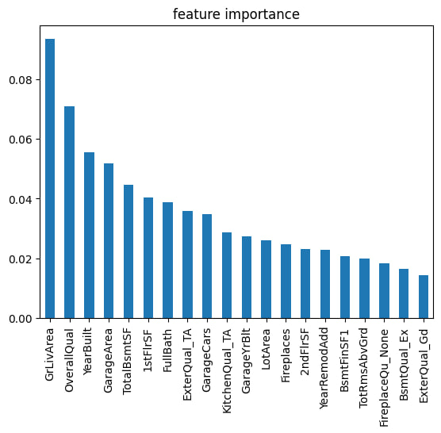

# House Prices Prediction

My solution for the [House Prices: Advanced Regression Techniques](https://www.kaggle.com/competitions/house-prices-advanced-regression-techniques/overview) Kaggle competition.

## What I did

Tried two models — CatBoostRegressor and GradientBoostingRegressor with GridSearchCV. Log-transformed the target for GBR to improve predictions.

To validate on real data, I used [this house from Zillow](https://www.zillow.com/homedetails/2650-Somerset-Dr-Ames-IA-50010/93954822_zpid/) and compared both models:

| Model | Prediction (2026) | Real price | Error |
|---|---|---|---|
| GradientBoostingRegressor | $364,091 | $374,900 | ~2.9% |
| CatBoostRegressor | $341,083 | $374,900 | ~9.0% |

Since the dataset is from 2006–2010, predictions were adjusted to 2026 prices using the [FHFA HPI index](https://www.fhfa.gov/document/d/hpi/fhfa-hpi-monthly-april-2026) (house prices in the US went up ~106% since 2008).

## Models

**CatBoostRegressor**
```python
CatBoostRegressor(
    iterations=5000,
    learning_rate=0.01,
    depth=6,
    loss_function='RMSE'
)
```

**GradientBoostingRegressor** — best params from GridSearchCV (192 combinations, 5-fold CV):
```python
{
    'learning_rate': 0.01,
    'max_depth': 5,
    'max_features': 'sqrt',
    'min_samples_leaf': 1,
    'min_samples_split': 20,
    'n_estimators': 1000
}
```

## Top features



The most important ones turned out to be `GrLivArea`, `OverallQual`, `YearBuilt`, `GarageArea` and `TotalBsmtSF` — which makes a lot of sense intuitively.

## How to run

1. Download the data from [Kaggle](https://www.kaggle.com/competitions/house-prices-advanced-regression-techniques/data) and unzip it into the same folder
2. Run all cells in the notebook
3. When prompted, choose the estimator: `cbr` for CatBoost or `gbr` for GradientBoosting
